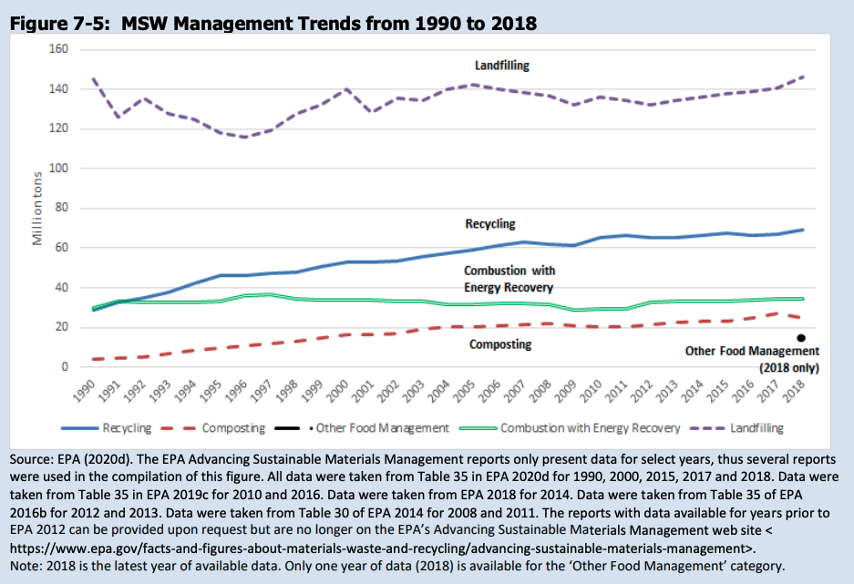
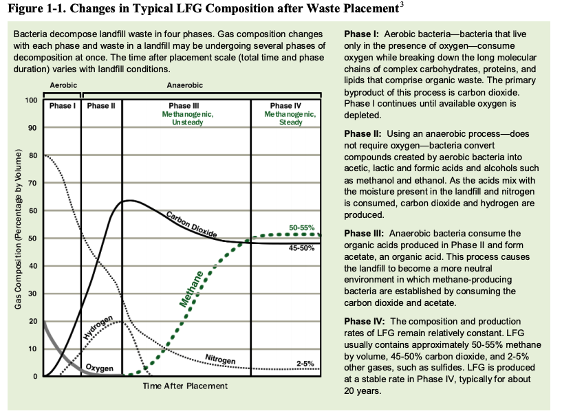
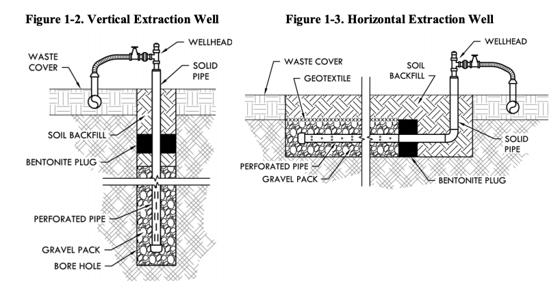
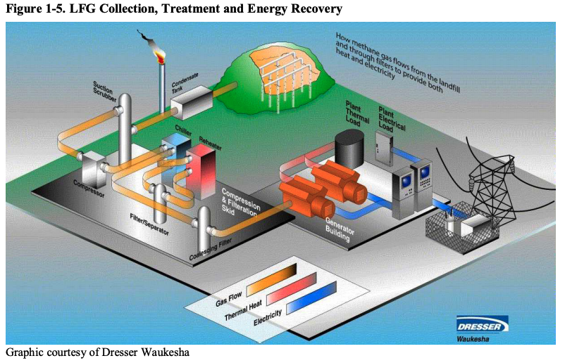
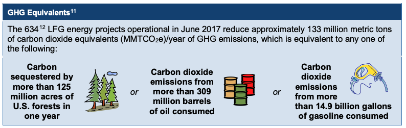

# Existing Solution Efforts

While recycling and composting have increased over the last 20 years, the tonnage of landfill waste has not significantly decreased.

## [Landfill Methane Outreach Program (LMOP)](https://www.epa.gov/lmop)
LMOP is a voluntary program run by the EPA that works with industrial waste management companies to reduce the methane emissions for landfills and attempts to use the landfil gas (LFG) as an energy source.

The life cycle of gas emission on landfill organic waste (this is usually food waste, paper, or yard scrappings) is described below.

But this release of methane is doubly harmful, because it could be used an an energy source to replace natural gas, coal, or fuel oil. This can be done either by directly using LFG as medium-Btu gas or by processing the methane emission into renewable natural gas (RNG). Methane can be collected through vertical or horizontal wells placed throughout the landfill.

Then the extracted gas needs some basic treatment - dehumidification, particulate filtration, and compression, to be reused as an energy source.

The LMOP has been able to make significant impact with the landfills they collaborate with.

All of the above images come from the [LFG Energy Project Development Handbook](https://www.epa.gov/sites/production/files/2016-07/documents/pdh_chapter1.pdf).
