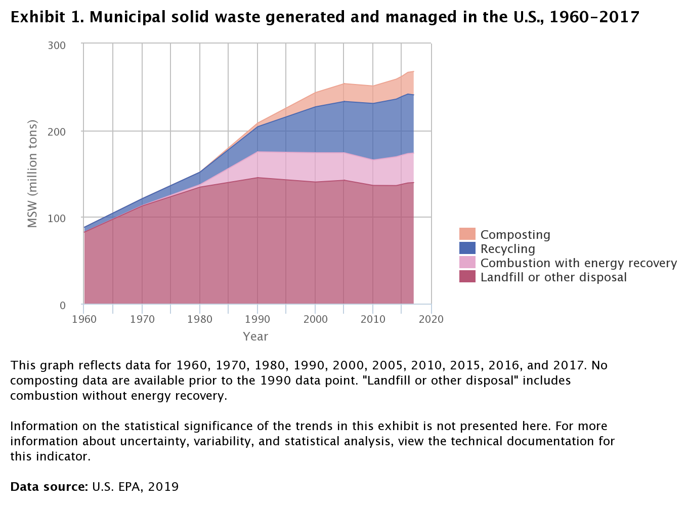
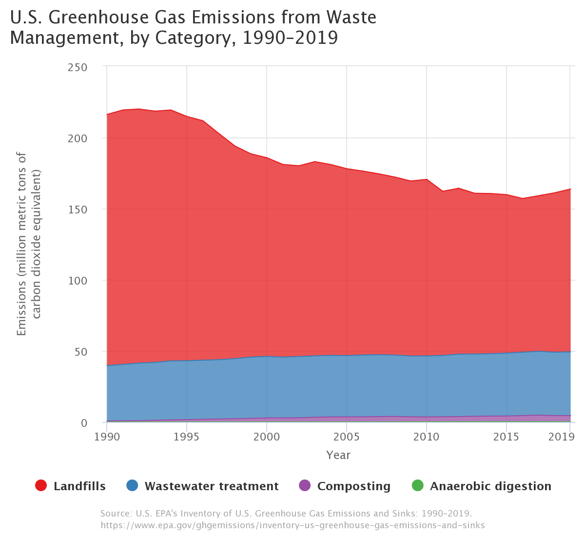
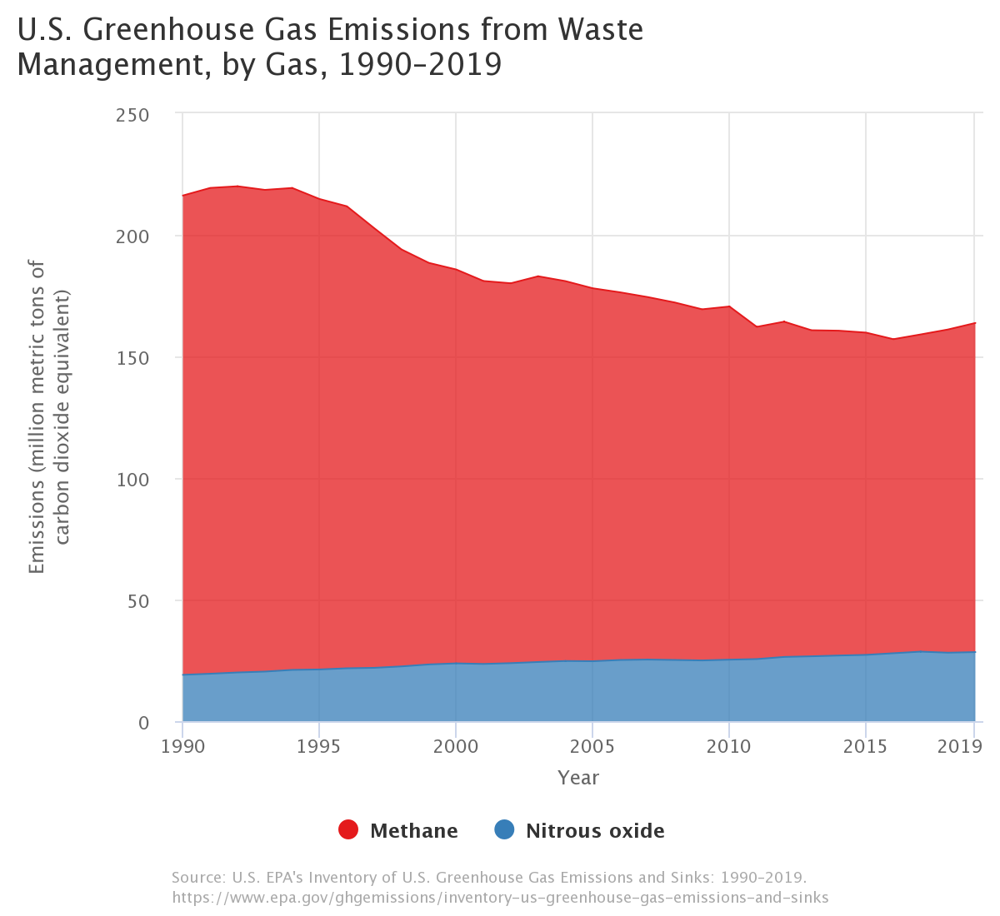
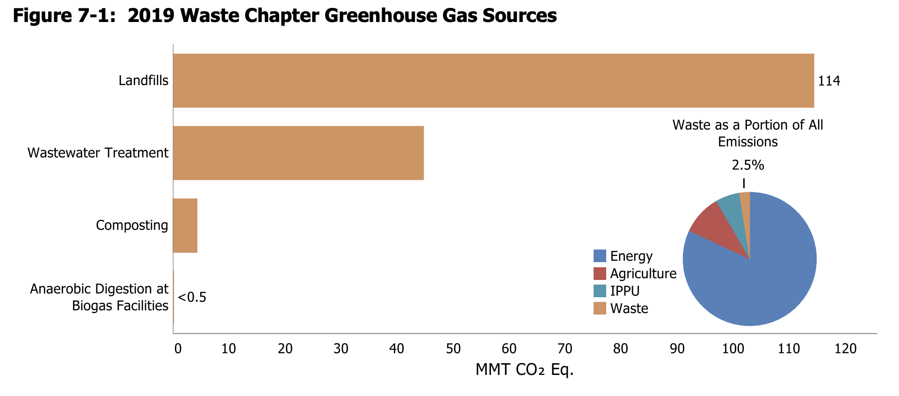
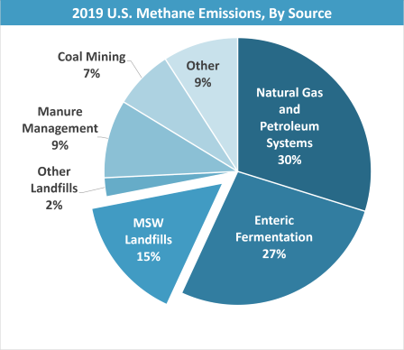

# Characterizing the (Great) Problem

## Why is waste is a great problem?

In our view, when all the externalities are taken together, the generation of waste qualifies as a great problem. In this section, we will outline some of the dimensions surrounding waste generation as a great problem:

### Greenhouse gas emissions

As visualized elsewhere, the decomposition of MSW contributes a fifth of U.S. methane emissions, equivalent to the emissions from 26 million average passenger vehicles. Moreover, waste combustion further contributes to the generation of greenhouse gasses. Several recyclable or reusable materials are disposed of in landfills rather than being recycled, including organic waste and paper. [[1]]

### Negative health effects of pollution

Several types of waste are detrimental to human health when improperly disposed. Disposing of E-waste exposes people to a combination of hazardous chemicals. As much of this waste is disposed of in developing countries, the necessary safeguards to ensure safe disposal are seldom in place [[2]]. In the U.S. the hazardous waste is frequently disposed of in minority communities, leading to negative health outcomes in these communities and contributing to existing disparities [[3]]. Meanwhile, micro-plastics have been found in drinking water around the world, and while the long-term health effects of this pollution are still uncertain, the WHO views the removal of micro-plastics from drinking water as a priority [[4]]. Meanwhile, air pollution has been shown to reduce global life expectancy by two years [[5]].

### Depletion of resources

Every year, non-renewable resources are buried in landfills. For example, 98% of lithium batteries in Australia end up in landfills [[6]]. While there are proposals to mine landfills for resources ranging from methane to rare metals [[7]], reducing the amount of recyclable material that is disposed of in landfills would reduce the risk of pollution from hazardous chemicals and would likely be more energy efficient than mining landfills.

### Philosophical reasons not to waste

Several schools of philosophy argue that waste is per se undesirable. The Kenyan environmentalist Wangari Maathai popularized the Japanese concept of Mottainai - the idea that waste is regrettable - as a slogan to promote environmental protection [[8]]. In additional to the consequentialist concerns laid out above, a philosophical argument can be made that frugality - in the broadest sense - is a virtue. This concept is not unique to Japanese philosophy: transcendentalists like Henry Louis Thoreau argued that a good life is “spartan” (see e.g., Walden).

[1]:https://www.sciencedirect.com/science/article/abs/pii/S0956053X07000712
[2]:https://www.niehs.nih.gov/research/programs/geh/geh_newsletter/2014/2/spotlight/ewaste_an_emerging_health_risk_.cfm
[3]:https://www.nrc.gov/docs/ML1310/ML13109A339.pdf
[4]:https://www.who.int/water_sanitation_health/publications/microplastics-in-drinking-water/en/
[5]:https://news.uchicago.edu/story/air-pollution-reduces-global-life-expectancy-nearly-two-years
[6]:https://www.sciencedirect.com/science/article/pii/S2212827116300701
[7]:http://www.enviroalternatives.com/landfill.html
[8]:https://www.cbd.int/doc/external/cop-09/bnj-nature-en.pdf

## Municipal Solid Waste (aka Trash)
Municipal Solid Waste, according to the US Environmental Protection Agency (EPA), is defined as:
> *Waste from homes, institutions, and commercial sources consisting of everyday items such as product packaging, grass clippings, furniture, clothing, bottles and cans, food scraps, newspapers, appliances, consumer electronics, and batteries.*

Basically everything under the colloquial "trash" term. The EPA provides time series data on the quantity of trash produced in the US since 1960.

An interactive version of the plot can be found [here](https://cfpub.epa.gov/roe/indicator.cfm?i=53#e). Note that the plot is a bit misleading since each category of MSW waste is summed on top of each other - i.e. there was 67.8 million tons of recycling in 2017 and 139.59 million tons of landfill or other disposal, as opposed to more recycling than landfill waste.

The EPA annually releases the Inventory of the U.S. Greenhouse Gas Emissions and Sinks, and provides a [data explorer](https://cfpub.epa.gov/ghgdata/inventoryexplorer/index.html) tool to examine the emissions by sector.

Interactive plot found [here](https://cfpub.epa.gov/ghgdata/inventoryexplorer/#waste/entiresector/allgas/category/all).

Interactive plot found [here](https://cfpub.epa.gov/ghgdata/inventoryexplorer/#waste/entiresector/allgas/gas/all).

In 2019, the total US methane emission was 659.71 MMT CO2 (million metric tons of carbon dioxide equivalent), while the methane emissions from waste alone were at 135.35 MMT CO2. Therefore, waste management (mostly 'landfill and other disposal' methods) accounted for about **21% of all methane emission in 2019**. This is a rather sizable contribution.

The 2021 Greenhouse Gas Inventory report has a [whole chapter on waste](https://www.epa.gov/sites/production/files/2021-04/documents/us-ghg-inventory-2021-chapter-7-waste.pdf). This chapter explains that Landfills accounted for ~17.4% of all US anthropogenic methane emissions in 2019, which is the third largest contributing source. Additionally, wastewater treatment and organic composting is responsible for 6.2 percent of all Nitrous oxide emissions.

Additionally, the [EPA methane emissions summary page](https://www.epa.gov/ghgemissions/overview-greenhouse-gases#methane) provides this graphic, attributing 15% of all methane release to MSW landfills.

